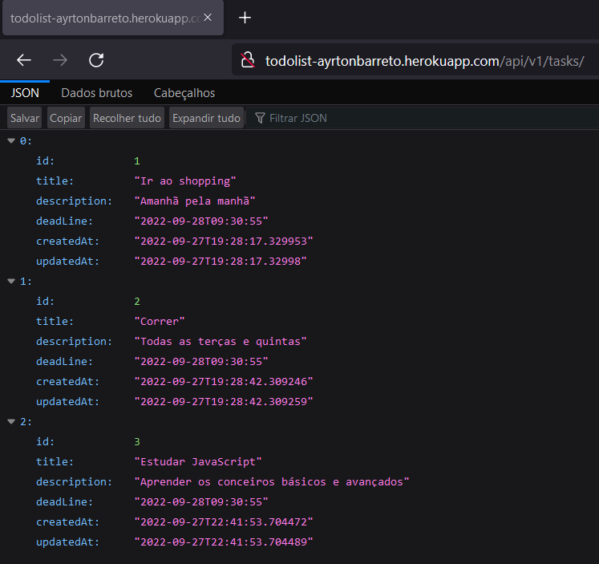
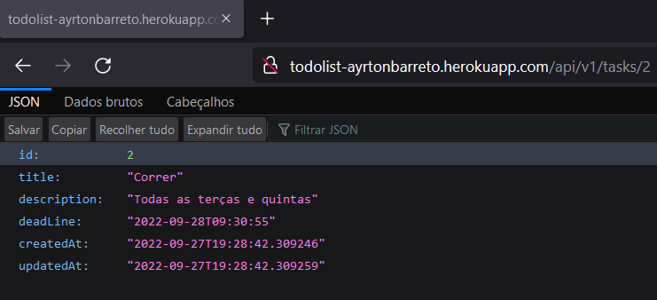
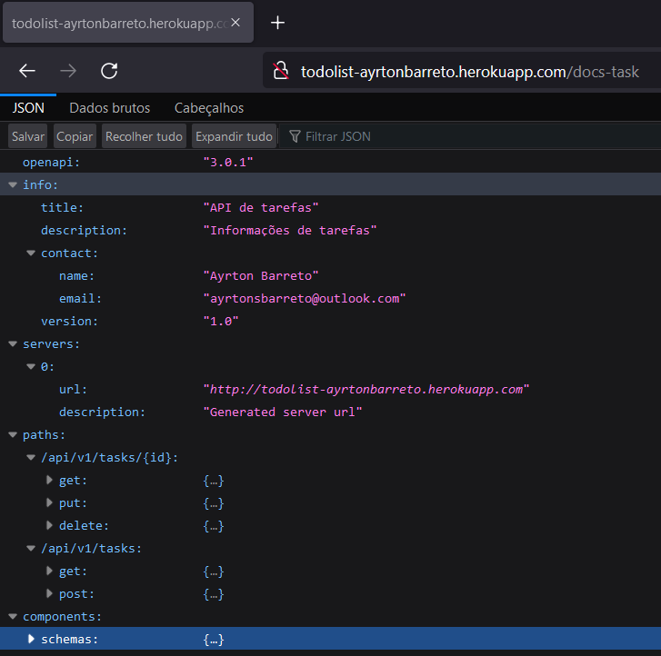

<h1 align="center">TO DO LIST</h1>

<h2>🎯 Objetivo do Projeto</h2>

 Desenvolvimento de uma aplicação Todo List, no qual é possível cadastrar, listar, buscar por id, editar e excluir tarefas. Além disso, a aplicação foi documentada utilizando o Swagger 3 e feito o deploy no Heroku. 

<h2>🛠 Tecnologias Utilizadas </h2>

<ul>
    <li>Java 17</li>
    <li>Spring MVC</li>
    <li>Spring Data JPA</li>
    <li>Spring Doc + Swagger 3</li>
    <li>H2 Database</li>
    <li>PostgreSQL</li>
    <li>Lombok</li>
    <li>Postman</li>
    <li>IDE Intellij</li>
    <li>Heroku</li>
</ul>

<h2>💻 Consultas à API </h2>

<h3> Buscando todas as tarefas </h3>

  

<h3> Buscando uma tarefa por ID </h3>

  

<h3> Informações da API </h3>

  

<h3> Documentação da API </h3>

  

